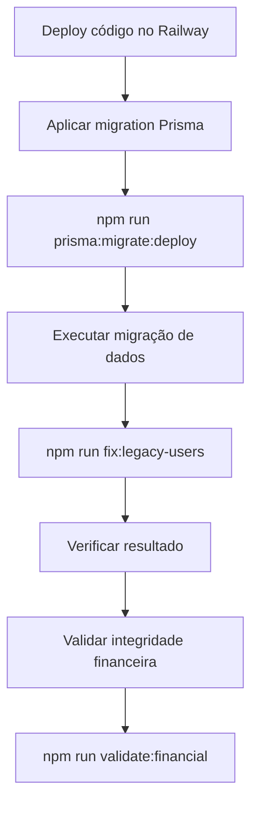

# 📁 Sumário de Arquivos - Migração de Usuários Legados

## ✅ Arquivos Criados/Modificados

### 📖 Documentação

| Arquivo | Descrição | Quando Usar |
|---------|-----------|-------------|
| [`QUICK_START_LEGACY_MIGRATION.md`](QUICK_START_LEGACY_MIGRATION.md) | **START HERE** - Guia rápido com comandos prontos | Primeira leitura - execução rápida |
| [`LEGACY_USERS_MIGRATION_GUIDE.md`](LEGACY_USERS_MIGRATION_GUIDE.md) | Guia completo com arquitetura e troubleshooting | Referência técnica detalhada |
| [`RAILWAY_LEGACY_MIGRATION.md`](RAILWAY_LEGACY_MIGRATION.md) | Instruções específicas para Railway | Deploy em produção |
| [`backend/scripts/README.md`](backend/scripts/README.md) | Guia rápido de scripts | Referência de comandos |

### 🔧 Scripts Executáveis

| Arquivo | Tipo | Uso | Comando |
|---------|------|-----|---------|
| [`backend/scripts/fix-legacy-users.js`](backend/scripts/fix-legacy-users.js) | JavaScript | **Principal** - Migração via Node.js | `npm run fix:legacy-users` |
| [`backend/scripts/fix-legacy-users.sql`](backend/scripts/fix-legacy-users.sql) | SQL | Alternativa - Migração via SQL direto | `psql < fix-legacy-users.sql` |
| [`backend/scripts/create-legacy-migration.sh`](backend/scripts/create-legacy-migration.sh) | Bash | Helper para criar migration Prisma | `./create-legacy-migration.sh` |

### 🗃️ Schema & Migrations

| Arquivo | Modificação | Impacto |
|---------|-------------|---------|
| [`backend/prisma/schema.prisma`](backend/prisma/schema.prisma) | ✏️ Modificado | Adicionado `isLegacyUser`, removido `@unique` de `name` |
| Migration (a ser criada) | ➕ Nova | Migration Prisma com schema changes |

### 💻 Código da Aplicação

| Arquivo | Modificação | O Que Foi Alterado |
|---------|-------------|-------------------|
| [`backend/src/routes/auth.ts`](backend/src/routes/auth.ts) | ✏️ Modificado | Validação de nome duplicado usa `isLegacyUser = false` |
| [`backend/package.json`](backend/package.json) | ✏️ Modificado | Adicionado `fix:legacy-users` e `prisma:migrate:deploy` |
| [`frontend/src/pages/CampaignDetail.tsx`](frontend/src/pages/CampaignDetail.tsx) | ✏️ Modificado | Simplificado `getCustomerDisplayName()` |
| [`backend/src/routes/analytics.ts`](backend/src/routes/analytics.ts) | ✏️ Modificado | Simplificada agregação por cliente |

---

## 🎯 Fluxo de Execução



---

## 📋 Comandos por Ambiente

### Local (Docker)
```bash
# Aplicar schema changes
docker exec compra-coletiva-backend npm run prisma:migrate:deploy

# Migrar dados
docker exec compra-coletiva-backend npm run fix:legacy-users

# Validar
docker exec compra-coletiva-backend npm run validate:financial
```

### Railway (Produção)
```bash
# Aplicar schema changes
railway run --service backend npm run prisma:migrate:deploy

# Migrar dados
railway run --service backend npm run fix:legacy-users

# Validar
railway run --service backend npm run validate:financial
```

---

## 🔍 Como Cada Arquivo Se Relaciona

### 1️⃣ **Documentação** (Leitura)
- Comece por: [`QUICK_START_LEGACY_MIGRATION.md`](QUICK_START_LEGACY_MIGRATION.md)
- Detalhes técnicos: [`LEGACY_USERS_MIGRATION_GUIDE.md`](LEGACY_USERS_MIGRATION_GUIDE.md)
- Railway específico: [`RAILWAY_LEGACY_MIGRATION.md`](RAILWAY_LEGACY_MIGRATION.md)

### 2️⃣ **Execução** (Comandos)
- **Recomendado**: `npm run fix:legacy-users` → executa [`fix-legacy-users.js`](backend/scripts/fix-legacy-users.js)
- **Alternativo**: SQL direto → executa [`fix-legacy-users.sql`](backend/scripts/fix-legacy-users.sql)

### 3️⃣ **Validação** (Verificação)
- Frontend: Verificar visualmente os pedidos separados
- Backend: `npm run validate:financial`
- Database: Queries SQL de verificação (ver documentação)

---

## 📦 Arquivos que Vão para o Railway

Quando você fizer `git push` e o Railway deployar, estes arquivos estarão disponíveis:

✅ **Incluídos no Deploy**:
- `backend/scripts/fix-legacy-users.js` (executável via npm)
- `backend/scripts/fix-legacy-users.sql` (opcional)
- `backend/package.json` (com comandos configurados)
- `backend/prisma/schema.prisma` (schema atualizado)
- Novas migrations Prisma (geradas automaticamente)

📄 **Documentação** (não afeta runtime):
- Todos os arquivos `.md` (para referência)

---

## 🎓 Exemplo de Uso Completo

### Cenário: Deploy Inicial no Railway

```bash
# Passo 1: Commit e push das mudanças
git add .
git commit -m "feat: add legacy users migration"
git push origin main

# Passo 2: Aguardar deploy do Railway
# (Railway automaticamente faz git pull e rebuild)

# Passo 3: Aplicar migration do schema
railway run --service backend npm run prisma:migrate:deploy

# Passo 4: Migrar dados legados
railway run --service backend npm run fix:legacy-users

# Passo 5: Validar resultado
railway run --service backend npm run validate:financial

# Passo 6: Verificar frontend
# Abrir aplicação e verificar se pedidos aparecem separados
```

### Cenário: Desenvolvimento Local

```bash
# Passo 1: Pull das mudanças
git pull origin main

# Passo 2: Rebuild containers
docker-compose down
docker-compose up -d --build

# Passo 3: Aplicar migration
docker exec compra-coletiva-backend npm run prisma:migrate:deploy

# Passo 4: Migrar dados
docker exec compra-coletiva-backend npm run fix:legacy-users

# Passo 5: Verificar no frontend
# Abrir http://localhost:5173
```

---

## 🆘 Troubleshooting Quick Reference

| Problema | Arquivo de Ajuda |
|----------|------------------|
| Erro na execução do script | [`LEGACY_USERS_MIGRATION_GUIDE.md`](LEGACY_USERS_MIGRATION_GUIDE.md) → Seção "Troubleshooting" |
| Problemas no Railway | [`RAILWAY_LEGACY_MIGRATION.md`](RAILWAY_LEGACY_MIGRATION.md) → Seção "⚠️ Troubleshooting" |
| Comandos não funcionam | [`QUICK_START_LEGACY_MIGRATION.md`](QUICK_START_LEGACY_MIGRATION.md) → Seção "🆘 Problemas Comuns" |
| Pedidos ainda agrupados | [`backend/scripts/README.md`](backend/scripts/README.md) → Seção "Troubleshooting" |

---

## ✅ Checklist Final de Implementação

### Desenvolvimento
- [x] Schema Prisma atualizado
- [x] Rotas de autenticação atualizadas
- [x] Frontend simplificado
- [x] Script de migração criado
- [x] Comandos npm configurados
- [x] Documentação completa

### Deploy
- [ ] Commit e push das mudanças
- [ ] Railway rebuild automático
- [ ] `npm run prisma:migrate:deploy` executado
- [ ] `npm run fix:legacy-users` executado
- [ ] Validação financeira OK
- [ ] Frontend mostrando pedidos separados
- [ ] Novos usuários podem se registrar

---

**Data de Criação**: 2025-11-29
**Última Atualização**: 2025-11-29
**Versão**: 1.0
**Status**: ✅ Pronto para Produção
