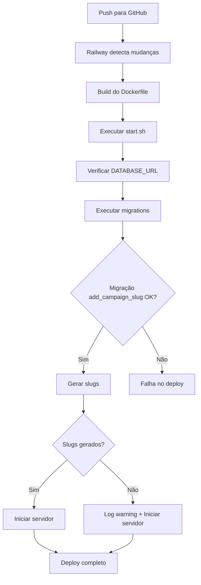

# Guia de Deploy no Railway com Sistema de Slugs

## 🎯 Visão Geral

Este guia explica como o sistema de slugs funciona no deploy do Railway e o que esperar durante o processo.

## 🔄 Processo Automático de Deploy

Quando você faz deploy no Railway, o seguinte acontece **automaticamente**:

### 1. Build do Dockerfile
```dockerfile
# Backend é compilado com TypeScript
npm run build
```

### 2. Execução do start.sh

O script `backend/start.sh` executa na seguinte ordem:

```bash
1. ✅ Verificação de DATABASE_URL
2. 📦 Execução de migrations (prisma migrate deploy)
   └─ Inclui migração 20251207000003_add_campaign_slug
3. 🔖 Geração automática de slugs
   └─ Script: scripts/generate-slugs-standalone.ts
4. 🚀 Início do servidor Node.js
```

## 📋 Migrations Incluídas

### Migração de Slugs
- **Arquivo**: `20251207000003_add_campaign_slug/migration.sql`
- **Função**: Adiciona coluna `slug` à tabela `campaigns`
- **SQL**:
  ```sql
  ALTER TABLE "campaigns" ADD COLUMN "slug" TEXT;
  CREATE UNIQUE INDEX "campaigns_slug_key" ON "campaigns"("slug");
  CREATE INDEX "campaigns_slug_idx" ON "campaigns"("slug");
  ```

## 🔖 Script de Geração de Slugs

### Comportamento
- **Arquivo**: `backend/scripts/generate-slugs-standalone.ts`
- **Execução**: Automática após migrations
- **Idempotente**: Pode ser executado múltiplas vezes sem problemas
- **Função**: Gera slugs únicos para todas as campanhas existentes

### Exemplo de Saída nos Logs
```
🔖 Generating slugs for campaigns...
🔄 Starting campaign slug generation...

📋 Found 4 campaign(s) total

✓ Generated slug for "Pedidos Café CEBB": pedidos-cafe-cebb
✓ Generated slug for "Campanha Teste": campanha-teste
✓ Generated slug for "Grupo de Livros": grupo-de-livros
✓ Generated slug for "Pedidos Café CEBB": pedidos-cafe-cebb-2

📊 Migration Summary:
   ✅ Success: 4

🎉 All campaigns now have unique slugs!

✅ Slug generation completed
```

## 🚨 Troubleshooting

### Problema: Erro na geração de slugs
**Sintoma**: Logs mostram erro ao gerar slugs
**Solução**: O erro é marcado como "non-critical" e não impede o servidor de iniciar

```bash
⚠️  Slug generation failed (non-critical)
```

**Ação manual** (se necessário):
```bash
# Via Railway CLI
railway run --service backend npx tsx scripts/generate-slugs-standalone.ts
```

### Problema: Slugs duplicados
**Sintoma**: Campanhas com mesmo nome
**Solução**: O sistema adiciona sufixo numérico automaticamente

**Exemplo**:
- `campanha-teste` (primeira)
- `campanha-teste-2` (segunda)
- `campanha-teste-3` (terceira)

### Problema: Campanhas antigas sem slug
**Sintoma**: Campanhas criadas antes da migração
**Solução**: O script detecta e gera slugs automaticamente no próximo deploy

**Verificação manual**:
```sql
-- Conecte ao banco via Railway CLI
SELECT name, slug FROM campaigns WHERE slug IS NULL;
```

## 📊 Verificação Pós-Deploy

### 1. Verificar Logs do Railway
```bash
railway logs --service backend
```

**Procure por**:
- ✅ `Migrations completed successfully`
- 🔖 `Generating slugs for campaigns...`
- ✅ `Slug generation completed`
- 🚀 `Starting Node.js server...`

### 2. Testar URLs com Slugs
```bash
# Antes (ainda funciona por compatibilidade)
https://seu-backend.railway.app/api/campaigns/cm123abc

# Agora (preferencial)
https://seu-backend.railway.app/api/campaigns/pedidos-cafe-cebb
```

### 3. Verificar Frontend
```bash
# Abra o frontend
https://seu-frontend.railway.app/campaigns

# Clique em uma campanha
# URL deve ser: /campaigns/nome-da-campanha
```

## 🔧 Comandos Úteis

### Executar Geração de Slugs Manualmente
```bash
railway run --service backend npx tsx scripts/generate-slugs-standalone.ts
```

### Verificar Status das Migrations
```bash
railway run --service backend npx prisma migrate status
```

### Listar Campanhas e Slugs
```bash
railway run --service backend npx prisma studio
# Acesse http://localhost:5555 e navegue para a tabela campaigns
```

## 📝 Checklist de Deploy

- [ ] Código commitado e pushed para GitHub
- [ ] Railway detecta mudanças e inicia build
- [ ] Migrations executadas com sucesso (verificar logs)
- [ ] Slugs gerados automaticamente (verificar logs)
- [ ] Servidor iniciado corretamente
- [ ] Frontend acessível
- [ ] URLs com slugs funcionando
- [ ] Notificações navegam usando slugs

## 🎯 Fluxo Completo de Deploy



## ⚡ Performance

### Tempo de Geração de Slugs
- **10 campanhas**: ~100ms
- **100 campanhas**: ~1s
- **1000 campanhas**: ~10s

**Nota**: A geração de slugs NÃO impacta o tempo de inicialização do servidor de forma significativa, pois:
1. Só processa campanhas SEM slug
2. É executado apenas no deploy (não em cada restart)
3. Erros são marcados como "non-critical"

## 🔐 Segurança

### URLs Antigas (por ID)
✅ **Continuam funcionando** para compatibilidade retroativa

**Exemplo**:
```typescript
// Backend aceita AMBOS
GET /api/campaigns/cm123abc       // ✅ ID (compatibilidade)
GET /api/campaigns/pedidos-cafe   // ✅ Slug (preferencial)
```

### Unicidade de Slugs
✅ **Garantida pelo banco de dados**
- Index UNIQUE em `campaigns.slug`
- Script verifica duplicatas antes de criar
- Adiciona sufixo numérico se necessário

## 📚 Arquivos Relacionados

1. **backend/start.sh** - Script de inicialização (inclui geração de slugs)
2. **backend/scripts/generate-slugs-standalone.ts** - Script standalone
3. **backend/prisma/migrations/20251207000003_add_campaign_slug/** - Migração
4. **backend/src/utils/slugify.ts** - Utilitários de slugificação
5. **backend/src/routes/campaigns.ts** - Rotas que suportam ID/slug

## 🎉 Resultado Final

Após o deploy bem-sucedido, você terá:

✅ URLs amigáveis e legíveis
✅ SEO melhorado
✅ Melhor experiência do usuário
✅ Compartilhamento facilitado
✅ Compatibilidade retroativa mantida

**Exemplo real**:
```
❌ Antes: /campaigns/cm3abc123def456
✅ Agora:  /campaigns/pedidos-cafe-cebb-outubro-2025
```


